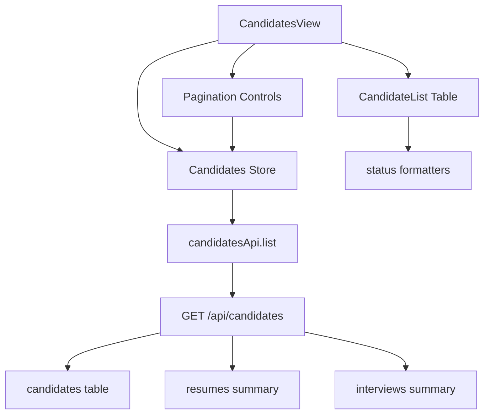

# Design Document

## Overview

本设计用于把当前候选人主页面从“全宽大卡片流”升级为“适用于桌面浏览的高密度分页列表”。设计范围覆盖：

- 候选人列表接口的数据摘要增强
- 共享类型扩展
- 前端候选人列表状态管理与分页状态接入
- 候选人页展示从卡片流改为表格化列表
- 简历状态、流程阶段、面试状态的统一颜色语义

该设计不重做候选人详情页，也不引入新的独立候选人搜索后端服务。它是在现有 `GET /api/candidates`、Pinia store、Vue 页面和 UI 组件基础上的一次增量升级。

## Steering Document Alignment

### Technical Standards (tech.md)
当前仓库未发现 `tech.md`，因此本设计以 `product.md` 与现有代码事实为准：

- 保持 `Vue 3 + Vite + Pinia + Tailwind` 前端架构
- 保持 `Bun.serve + Drizzle + SQLite` 后端实现
- 继续通过 `@ims/shared` 管理共享 API 契约
- 不引入新的 UI 框架或新的分页依赖

### Project Structure (structure.md)
当前仓库未发现 `structure.md`，因此实现将遵循现有目录约定：

- 页面保留在 `apps/web/src/views/`
- 领域组件保留在 `apps/web/src/components/candidates/`
- 通用 UI 组件复用 `apps/web/src/components/ui/`
- 状态保留在 `apps/web/src/stores/`
- 共享类型扩展在 `packages/shared/src/`
- 候选人列表接口增强仍在 `packages/server/src/routes.ts`

## Code Reuse Analysis

本次设计优先复用已存在的列表、徽章、状态格式与分页契约，而不是新增一整套候选人列表框架。

### Existing Components to Leverage
- **`apps/web/src/components/ui/table*.vue`**: 作为候选人主列表的新基础结构，替代当前的全宽卡片流。
- **`apps/web/src/components/ui/badge.vue`**: 复用现有状态徽章语义，不额外引入视觉系统。
- **`apps/web/src/views/ImportView.vue`**: 复用其“状态 badge + 紧凑元信息”的呈现模式。
- **`apps/web/src/composables/import/formatters.ts`**: 参考其“状态值 → 文案 / badge variant”映射方式，为候选人流程状态建立一致格式化器。
- **`apps/web/src/api/candidates.ts`**: 继续作为候选人列表接口入口，保留 `page/pageSize` 支持。
- **`apps/web/src/stores/candidates.ts`**: 扩展现有 store，而不是新增平行 store。

### Integration Points
- **`GET /api/candidates`**: 扩展返回候选人列表摘要字段与正确分页总数。
- **`packages/shared/src/api-types.ts`**: 扩展 `CandidateListData` 的 `items[]` 结构为“基础候选人信息 + 列表摘要信息”。
- **`packages/server/src/routes.ts`**: 在当前列表查询处引入轻量聚合，读取最新简历和面试状态。
- **`apps/web/src/views/CandidatesView.vue`**: 作为分页状态与搜索状态的组合入口。

## Architecture

### 高层架构说明

候选人列表改版采用“三段式结构”：

1. **Summary API Layer**
   - 后端 `GET /api/candidates` 继续作为唯一列表入口
   - 在候选人基础信息之外返回列表页需要的摘要状态
   - 计算过滤后的真实总数，为分页器提供稳定元数据

2. **List State Layer**
   - `useCandidatesStore` 管理 `items / loading / total / page / pageSize`
   - 搜索、分页、立即同步后的刷新都通过统一 `fetchList` 收敛

3. **Presentation Layer**
   - `CandidatesView.vue` 负责组合搜索、同步状态、列表、分页器
   - `candidate-list.vue` 负责渲染高密度列表表格
   - 新增状态格式化器负责把摘要状态映射为文案和颜色

### Modular Design Principles
- **Single File Responsibility**: `CandidatesView.vue` 负责编排，`candidate-list.vue` 负责展示，状态格式化独立封装。
- **Component Isolation**: 列表展示组件不直接请求接口，只消费 props 和 emit 用户事件。
- **Service Layer Separation**: 列表摘要聚合逻辑留在 server route/data access 层，不把多表推导逻辑下放到前端。
- **Utility Modularity**: 状态文案与 badge variant 映射抽出成独立格式化器，避免模板中散落条件分支。



## Components and Interfaces

### Enhanced Candidates Store
- **Purpose:** 保存候选人列表、加载态、分页元数据，并为搜索 / 翻页 / 同步刷新提供统一入口。
- **Interfaces:**
  - `fetchList(params?: { search?: string; source?: string; page?: number; pageSize?: number })`
  - `setPage(page: number)`
  - `setPageSize(pageSize: number)`
  - `refreshCurrentPage()`
- **Dependencies:** `apps/web/src/api/candidates.ts`
- **Reuses:** 现有 `stores/candidates.ts` 请求与并发保护逻辑

### Candidate List Table
- **Purpose:** 把候选人列表渲染为可横向比较的高密度表格，而不是大卡片。
- **Interfaces:**
  - Props: `items`, `loading`, `page`, `pageSize`, `total`, `workspaceLoadingId`, `exportLoadingId`
  - Emits: `select`, `open-workspace`, `export`, `page-change`, `page-size-change`, `create`, `import`
- **Dependencies:** `ui/table*`, `ui/badge`, `ui/button`, 候选人状态格式化器
- **Reuses:** 现有候选人操作按钮与空态逻辑

### Candidate Status Formatter
- **Purpose:** 统一将 `resumeStatus / pipelineStage / interviewState` 映射为文案与 badge 颜色。
- **Interfaces:**
  - `resumeStatusLabel(status)` / `resumeStatusVariant(status)`
  - `pipelineStageLabel(stage)` / `pipelineStageVariant(stage)`
  - `interviewStateLabel(state)` / `interviewStateVariant(state)`
- **Dependencies:** `Badge` 现有变体语义
- **Reuses:** `ImportView` 的状态映射思路

### Candidate List Summary Endpoint Contract
- **Purpose:** 为列表页提供足够但克制的候选人摘要信息，避免逐条请求详情页。
- **Interfaces:**
  - `GET /api/candidates?search=&source=&page=&pageSize=`
  - Response: `{ items, total, page, pageSize }`
- **Dependencies:** `candidates`, `resumes`, `interviews` 表
- **Reuses:** 现有候选人列表路由与搜索过滤逻辑

## Data Models

### CandidateListItemSummary
```ts
type CandidateResumeStatus = "missing" | "uploaded" | "parsed" | "failed";
type CandidatePipelineStage = "new" | "screening" | "interview" | "offer" | "rejected";
type CandidateInterviewState = "none" | "scheduled" | "completed" | "cancelled";

type CandidateListItemSummary = Candidate & {
  tags: string[];
  resumeStatus?: CandidateResumeStatus;
  pipelineStage?: CandidatePipelineStage;
  interviewState?: CandidateInterviewState;
  lastActivityAt?: number | null;
};
```

说明：
- 这些字段先定义为可选，确保改造可渐进落地。
- `pipelineStage` 是列表摘要阶段，不等于完整工作流历史。

### CandidateListData
```ts
type CandidateListData = {
  items: CandidateListItemSummary[];
  total: number;
  page: number;
  pageSize: number;
};
```

### Summary Derivation Rules
```ts
type CandidateSummaryDerivation = {
  resumeStatus: "latest resume" summary;
  interviewState: "latest interview" summary;
  pipelineStage: derived from latest resume/interview presence and states;
  lastActivityAt: max(candidate.updatedAt, latestResume.createdAt, latestInterview.updatedAt);
};
```

建议规则：
- `resumeStatus`
  - 无简历：`missing`
  - 有简历但未解析：`uploaded`
  - 有解析结果：`parsed`
  - 最近导入或解析失败：`failed`
- `interviewState`
  - 无面试：`none`
  - 最近面试 `status=scheduled`：`scheduled`
  - 最近面试 `status=completed`：`completed`
  - 最近面试 `status=cancelled`：`cancelled`
- `pipelineStage`
  - 默认：`new`
  - 有简历且未进入面试：`screening`
  - 有面试记录：`interview`
  - 如后续已有 offer / rejected 明确信息，可映射到对应值；当前阶段先支持保守派生，不强行虚构业务状态

## Detailed Design

### 1. 后端列表接口增强

当前 `/api/candidates` 仅从 `candidates` 表读取基础字段，并返回 `total: items.length`。本次调整：

- 保留当前过滤参数：`search / source / page / pageSize`
- 新增“过滤后的总数统计”查询，确保 `total` 为真实总量
- 为每个候选人派生列表摘要：
  - 最新简历状态
  - 最新面试状态
  - 派生阶段
  - 最近活动时间

为了控制实现复杂度，摘要派生采用“每个候选人只取最新相关记录”的轻量策略，而不是引入复杂统计报表模型。

### 2. 共享类型扩展

`packages/shared/src/api-types.ts` 的 `CandidateListData.items[]` 从单纯 `Candidate & { tags }` 扩展为包含摘要状态的列表项类型。

这样 server 与 web 共享同一契约，避免前端自行猜测状态字段。

### 3. 前端列表状态重构

`stores/candidates.ts` 需要从“只保存 items”升级为“保存完整分页状态”：

- `list`
- `loading`
- `total`
- `page`
- `pageSize`
- `current`

`fetchList` 统一接收搜索词、来源、页码和每页条数，并在结果返回后一次性写入完整状态。

### 4. 候选人列表展示重构

`candidate-list.vue` 从当前 `Card v-for` 改为 `Table` 结构，建议首批列：

- 候选人（姓名 + 来源 badge）
- 岗位
- 经验
- 简历状态
- 当前阶段
- 面试状态
- 最近活动
- 操作

桌面主视图优先密度与对比性，因此采用单行列表，而不是继续使用多段式卡片。

### 5. 分页器设计

仓库当前没有现成分页组件，因此直接在候选人列表底部实现轻量分页栏：

- 上一页 / 下一页
- 当前页与总页数
- 每页条数选择（如 20 / 50 / 100）

不引入新的组件库。若后续多个页面都需要分页，再抽取为通用组件。

### 6. 状态颜色设计

复用现有 `Badge` 变体语义：

- `default`：积极或完成态（如 `parsed`, `completed`, `offer`）
- `secondary`：处理中 / 进行中（如 `screening`, `interview`, `scheduled`）
- `outline`：中性 / 未开始（如 `missing`, `new`, `none`）
- `destructive`：失败 / 负向态（如 `failed`, `rejected`, `cancelled`）

这样能与 `ImportView.vue` 的颜色直觉保持一致。

## Error Handling

### Error Scenarios
1. **候选人摘要状态无法派生**
   - **Handling:** 后端返回中性默认值（如 `resumeStatus="missing"`, `interviewState="none"`, `pipelineStage="new"`）
   - **User Impact:** 行仍可正常显示，只是状态为默认值

2. **分页参数异常或越界**
   - **Handling:** 后端继续使用现有的页码保护逻辑（最小 1，最大 pageSize 100）
   - **User Impact:** 页面自动回到合法分页，不出现崩溃

3. **同步后当前页数据发生变化**
   - **Handling:** 前端在立即同步后刷新当前筛选与分页状态对应的数据
   - **User Impact:** 用户会看到列表更新，但不会丢失当前上下文

4. **列表字段扩展后旧前端未同步**
   - **Handling:** 新增字段在共享类型中先定义为可选，避免硬性破坏
   - **User Impact:** 渐进升级兼容旧渲染逻辑

## Testing Strategy

### Unit Testing
- 为候选人状态格式化器添加单元测试，验证状态文案与 badge variant 映射
- 为前端 API 层或 store 分页状态写入逻辑补充测试（若沿用现有测试模式）

### Integration Testing
- 验证 `GET /api/candidates` 在有搜索 / 分页 / 状态摘要时返回正确结构
- 验证前端翻页、改 pageSize、搜索后重置第一页
- 验证“立即同步”后列表摘要会刷新

### End-to-End Testing
- 用户打开候选人页，看到高密度表格而非大卡片
- 用户浏览多页候选人，并能根据状态颜色快速识别流程阶段
- 用户点击候选人仍可进入详情页，操作按钮仍可用
