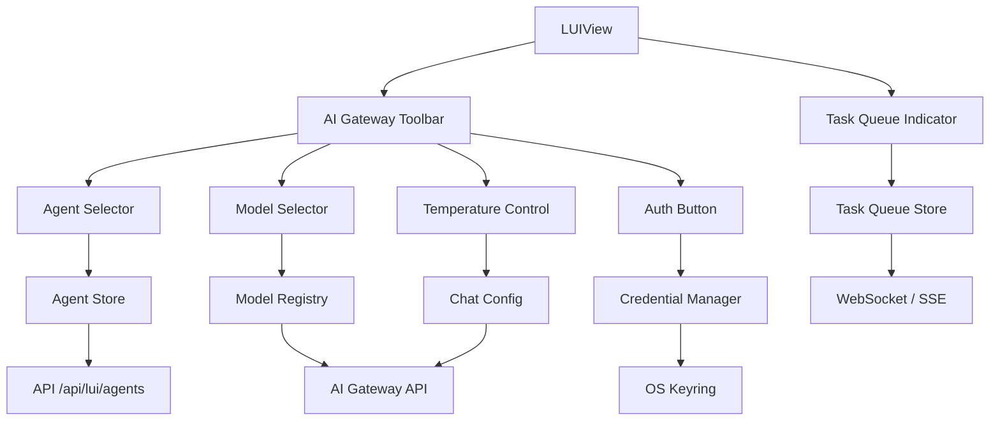

# Design Document

## Overview

LUI AI Gateway 是 Interview Manager System 的 AI 服务基础设施层，负责统一管理 AI 模型接入、智能体配置、凭证安全和任务队列。它作为 LUI 与外部 AI 服务之间的网关，提供统一接口屏蔽底层差异。

## Steering Document Alignment

### Technical Standards (tech.md)
- 使用 Vue 3 Composition API + Pinia 进行状态管理
- 遵循模块化设计原则，每个模块单一职责
- 使用 TypeScript 严格模式，确保类型安全

### Project Structure (structure.md)
- 前端组件位于 `apps/web/src/components/lui/`
- 状态管理位于 `apps/web/src/stores/lui/`
- 工具函数位于 `apps/web/src/lib/`
- API 客户端位于 `apps/web/src/api/`

## Code Reuse Analysis

### Existing Components to Leverage
- **`prompt-input.vue`**: 在底部工具栏扩展，添加模型/智能体/强度选择器
- **`useLuiStore`**: 扩展示例以支持 AI Gateway 配置
- **`candidate-selector.vue`**: 参考其实现模式构建模型/智能体选择器

### Integration Points
- **Vercel AI SDK**: 使用 `useChat` hook 和 `streamText` 进行 AI 交互
- **OS Keyring**: Tauri API 调用系统密钥环存储 API Key
- **LUI Store**: 新增 `ai-gateway.ts` 模块管理 AI 配置状态

## Architecture



### Modular Design Principles
- **Single File Responsibility**: 每个选择器独立组件，独立状态模块
- **Component Isolation**: AI Gateway Toolbar 作为容器组件，各选择器可独立使用
- **Service Layer Separation**: `ai-gateway.ts` 封装所有 AI 相关 API 调用
- **Utility Modularity**: `credential-manager.ts` 专注凭证管理，与业务逻辑解耦

## Components and Interfaces

### Component 1: Agent Selector
- **Purpose**: 智能体切换选择器，展示已保存的智能体列表
- **Interfaces**:
  - `selectedAgent: Agent | null` - 当前选中的智能体
  - `agents: Agent[]` - 可用智能体列表
  - Events: `@select`, `@create`, `@edit`
- **Dependencies**: `useAgentStore`, `useLuiStore`
- **Reuses**: DropdownMenu, Button 等 shadcn 组件

### Component 2: Model Selector
- **Purpose**: AI 模型选择器，按提供商分组展示可用模型
- **Interfaces**:
  - `selectedModel: ModelConfig | null` - 当前选中的模型
  - `models: ModelProvider[]` - 按提供商分组的模型列表
  - `authStatus: Record<string, boolean>` - 各模型授权状态
  - Events: `@select`, `@authorize`
- **Dependencies**: `useModelStore`, `useCredentialStore`
- **Reuses**: DropdownMenu, Badge (显示授权状态)

### Component 3: Temperature Control
- **Purpose**: 强度调节器，三档快速切换 + 精确滑块
- **Interfaces**:
  - `value: number` - 当前 temperature (0.0 - 1.0)
  - `preset: 'precise' | 'balanced' | 'creative'` - 当前档位
  - Events: `@change`
- **Dependencies**: 无（纯 UI 组件）
- **Reuses**: Slider, ButtonGroup

### Component 4: Auth Button
- **Purpose**: 一键授权按钮，处理 OAuth/API Key 输入
- **Interfaces**:
  - `provider: string` - 要授权的提供商
  - `isAuthorized: boolean` - 是否已授权
  - Events: `@authorize`, `@revoke`
- **Dependencies**: `useCredentialStore`
- **Reuses**: Dialog (授权弹窗), Button, Input

### Component 5: Task Queue Indicator
- **Purpose**: 待办指示器，展示 AI 任务队列状态
- **Interfaces**:
  - `tasks: Task[]` - 当前任务列表
  - `isVisible: boolean` - 是否显示
  - Events: `@click` (展开详情)
- **Dependencies**: `useTaskQueueStore`
- **Reuses**: Badge, Progress, Collapsible

## Data Models

### Agent
```typescript
interface Agent {
  id: string;
  name: string;
  description: string;
  systemPrompt: string;
  tools: string[];        // 启用的工具 ID 列表
  defaultModel: string;   // 默认模型 ID
  defaultTemperature: number;
  isDefault: boolean;     // 是否为默认智能体
  createdAt: string;
  updatedAt: string;
}
```

### Model Config
```typescript
interface ModelConfig {
  id: string;
  provider: string;       // 'openai' | 'anthropic' | 'google' | etc.
  name: string;
  displayName: string;
  maxTokens: number;
  supportsStreaming: boolean;
  supportsTools: boolean;
  requiresAuth: boolean;
}

interface ModelProvider {
  id: string;
  name: string;
  icon: string;           // Lucide icon name
  models: ModelConfig[];
}
```

### Credential
```typescript
interface Credential {
  provider: string;
  type: 'api_key' | 'oauth';
  // API Key 存储在 OS Keyring，内存中仅保留引用
  isValid: boolean;       // 凭证是否有效
  expiresAt?: string;     // OAuth token 过期时间
}
```

### Chat Config
```typescript
interface ChatConfig {
  agentId: string | null;
  modelId: string | null;
  temperature: number;
  maxTokens?: number;
}
```

### Task
```typescript
interface Task {
  id: string;
  type: 'chat' | 'tool' | 'file_process';
  status: 'pending' | 'running' | 'completed' | 'failed';
  description: string;
  progress?: number;      // 0-100
  createdAt: string;
  updatedAt: string;
}
```

## Error Handling

### Error Scenario 1: 授权失败
- **Handling**: 显示错误对话框，提供重试和手动输入选项
- **User Impact**: 模型选择器显示"授权失败"状态，允许重新授权

### Error Scenario 2: 模型不可用
- **Handling**: 自动切换到备用模型，或提示用户选择其他模型
- **User Impact**: 显示临时提示"已切换到 GPT-4"

### Error Scenario 3: 智能体加载失败
- **Handling**: 使用默认智能体配置，后台重试加载
- **User Impact**: 无感知，功能降级为默认智能体

### Error Scenario 4: 任务队列溢出
- **Handling**: 限制最大并发任务数，新任务进入等待队列
- **User Impact**: 待办指示器显示等待位置

## Testing Strategy

### Unit Testing
- Agent/Model/Temperature 选择器组件独立测试
- Credential Manager 加密/解密逻辑测试
- Task Queue 状态转换测试

### Integration Testing
- 授权流程完整测试 (点击授权 → Keyring 存储 → 状态更新)
- 模型切换 + 消息发送流程测试
- 智能体切换后工具配置正确加载测试

### End-to-End Testing
- 完整对话流程：选择智能体 → 选择模型 → 发送消息 → 接收流式响应
- 授权重试场景：授权失败 → 重试 → 成功 → 继续对话
