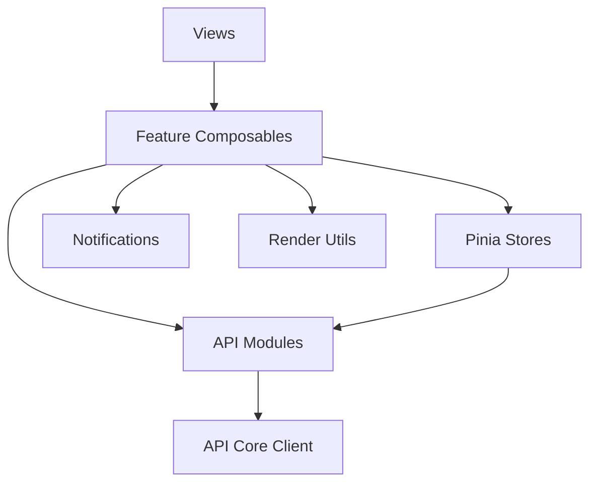

# Design Document

## Overview

本设计用于指导 `apps/web` 前端进行架构治理与模块重构。重点对象包括：

- `api/client.ts` 及各领域 API 模块
- `stores/lui.ts` 与相关 LUI 组件
- `views/ImportView.vue`
- `views/CandidatesView.vue`
- HTML/Markdown 渲染路径
- 错误处理、通知、轮询、取消控制与前端规则体系

本次设计不新增业务能力，而是通过建立清晰边界与统一实现规范，提高前端的长期可维护性、稳定性与安全性。

## Steering Document Alignment

### Technical Standards (tech.md)
当前仓库未发现 `tech.md`，因此本设计以现有代码事实与 `product.md` 中确认的技术栈为准：

- 前端技术栈保持 `Vue 3 + Vite + Pinia + Tailwind`
- 不引入新的重量级前端框架
- 继续复用 `@ims/shared` 中已有共享契约
- 保持 Tauri 桌面环境下的本地优先模式

### Project Structure (structure.md)
当前仓库未发现 `structure.md`，因此本设计将基于 `apps/web` 现有结构延展，遵循以下组织约定：

- 页面：`views/`
- 通用组件：`components/ui/`
- 领域组件：`components/lui/`
- 状态：`stores/`
- 数据访问：`api/`
- 工具与格式化：`lib/`
- 业务编排：新增 `composables/<domain>/`

## Code Reuse Analysis

本次设计优先复用现有基础设施与领域边界，而不是推翻重写。

### Existing Components to Leverage
- **`apps/web/src/api/client.ts`**: 作为统一请求入口的雏形，将被重构而非替换
- **`apps/web/src/api/auth.ts` / `candidates.ts` / `import.ts` / `lui.ts`**: 保留领域 API 组织方式，补充协议适配和边界收敛
- **`apps/web/src/stores/auth.ts`**: 其职责边界较清晰，可作为其他 store 收敛复杂度的参考
- **`apps/web/src/stores/candidates.ts`**: 作为较轻量的领域 store 模板保留
- **`apps/web/src/components/ui/*`**: 继续复用现有 UI 原子组件
- **`apps/web/src/composables/use-theme.ts`**: 保留现有全局横切能力组织方式
- **`apps/web/src/components/lui/*`**: 保留 feature 目录组织，但重塑组件职责

### Integration Points
- **`@ims/shared`**: 继续作为请求/响应 DTO、状态枚举与共享类型来源
- **本地 API 服务**: 继续通过 `/api/*` 代理访问本地 Bun 服务
- **Tauri 桌面环境**: 文件选择与路径处理需通过显式适配，而不是散落在页面内

## Architecture

### 高层架构说明

整改后的前端采用“五层结构”：

1. **View Layer**
   - 页面级组件，只负责布局、路由上下文、事件绑定与组合子组件
2. **Feature Layer**
   - 使用 composable 编排业务流程，如流式消息、轮询、文件选择、通知调用
3. **State Layer**
   - 使用 Pinia store 管理领域状态，不直接处理底层协议
4. **Data Access Layer**
   - 统一封装 JSON、FormData、流式响应、错误模型与取消控制
5. **Utility Layer**
   - 统一提供渲染、安全净化、格式化、错误映射与平台适配能力

### Modular Design Principles
- **Single File Responsibility**: 每个文件只处理一个清晰关注点
- **Component Isolation**: 组件不直接持有跨层副作用
- **Service Layer Separation**: 协议处理与页面/状态解耦
- **Utility Modularity**: 渲染、安全、格式化、平台适配分别封装



## Components and Interfaces

### API Core Client
- **Purpose:** 提供统一、协议感知的数据访问能力
- **Interfaces:**
  - `requestJson<T>(...)`
  - `requestForm<T>(...)`
  - `requestText(...)`
  - `requestStream(...)`
- **Dependencies:** `fetch`, `AbortController`, `@ims/shared`
- **Reuses:** 现有 `api/client.ts` 中的 envelope 解析思路

### LUI Conversations Store
- **Purpose:** 管理会话列表、选中会话、创建/删除会话、候选人绑定
- **Interfaces:**
  - `loadConversations()`
  - `selectConversation(id)`
  - `createConversation(input?)`
  - `deleteConversation(id)`
  - `updateConversationCandidate(id, candidateId | null)`
- **Dependencies:** `api/modules/lui.ts`
- **Reuses:** 现有 `stores/lui.ts` 中会话部分逻辑

### LUI Messages Store
- **Purpose:** 管理消息列表、发送状态、失败状态与消息重试
- **Interfaces:**
  - `loadConversationMessages(id)`
  - `appendLocalUserMessage(...)`
  - `appendAssistantPlaceholder(...)`
  - `applyStreamEvent(...)`
  - `markMessageError(...)`
- **Dependencies:** `useLuiMessageStreaming()`
- **Reuses:** 现有 `stores/lui.ts` 中消息状态与映射逻辑

### LUI Files Store
- **Purpose:** 管理文件资源列表、上传状态、删除状态、当前会话资源视图
- **Interfaces:**
  - `loadFiles(conversationId)`
  - `uploadFile(conversationId, file)`
  - `removeFile(conversationId, fileId)`
- **Dependencies:** `api/modules/lui.ts`
- **Reuses:** 现有 `stores/lui.ts` 中 fileResources 结构

### `useLuiMessageStreaming`
- **Purpose:** 管理流式消息发送、事件解析、错误恢复、取消控制
- **Interfaces:**
  - `send(conversationId, input)`
  - `cancel(conversationId)`
- **Dependencies:** `api/core/stream.ts`, `LUI Messages Store`
- **Reuses:** 现有流式发送的业务语义，但替换脆弱实现

### `useImportPolling`
- **Purpose:** 管理导入任务的串行轮询、停止条件与退避策略
- **Interfaces:**
  - `start()`
  - `stop()`
  - `refreshNow()`
- **Dependencies:** `api/modules/import.ts`
- **Reuses:** 现有 `ImportView.vue` 中的批次刷新逻辑

### `renderSafeMarkdown`
- **Purpose:** 为所有 HTML/Markdown 渲染提供统一安全入口
- **Interfaces:**
  - `renderSafeMarkdown(input: string): string`
- **Dependencies:** `marked`, `DOMPurify`
- **Reuses:** 现有 `file-resources.vue` 对 `DOMPurify` 的使用

### Notifications Module
- **Purpose:** 提供统一的成功、失败、警告、加载中反馈
- **Interfaces:**
  - `notifySuccess(message)`
  - `notifyError(error)`
  - `notifyInfo(message)`
- **Dependencies:** 全局 UI 提示实现
- **Reuses:** 现有页面上的用户反馈语义

## Data Models

### Request Error Model
```ts
type AppRequestError =
  | {
      type: "api";
      code: string;
      message: string;
      status: number;
      requestId?: string;
    }
  | {
      type: "network";
      message: string;
    }
  | {
      type: "timeout";
      message: string;
    }
  | {
      type: "aborted";
      message: string;
    };
```

### LUI Stream Event
```ts
type LuiStreamEvent =
  | { type: "message-start"; messageId: string }
  | { type: "message-text"; messageId: string; content: string }
  | { type: "message-reasoning"; messageId: string; content: string }
  | { type: "message-tool"; messageId: string; tool: unknown }
  | { type: "message-done"; messageId: string }
  | { type: "message-error"; messageId: string; error: string };
```

### Desktop Selected File
```ts
type DesktopSelectedFile = {
  file: File;
  localPath: string | null;
  source: "browser-input" | "desktop-picker";
};
```

## Detailed Design

### 1. API Client 重构

当前 `api/client.ts` 将所有请求统一视为 JSON，这与文件上传和流式响应需求冲突。整改后：

- `requestJson` 负责 JSON body 和 JSON response
- `requestForm` 负责 `FormData`
- `requestStream` 负责流式响应
- 错误统一映射为 `AppRequestError`
- 所有请求支持 `AbortSignal`

该设计使协议复杂度集中于 `api/core`，避免 store 和页面各自处理协议细节。

### 2. LUI 拆分设计

当前 `stores/lui.ts` 是高度耦合的超大 store。整改后按职责拆分：

- 会话状态与操作 → `conversations`
- 消息与流式状态 → `messages`
- 文件资源 → `files`

页面 `LUIView.vue` 只组合这些领域能力。  
`conversation-list.vue` 从“组件内部直接调 store + 再 emit”改为纯受控组件，只通过事件告诉上层“用户意图是什么”。

### 3. 流式消息处理设计

当前实现使用 `ReadableStream` + `chunk.split("\n")`，对跨 chunk 数据不稳定。整改后：

- 在 `api/core/stream.ts` 中维护 buffer
- 按事件边界解析，不依赖单次 chunk 完整性
- 任何解析失败都生成明确错误事件，而不是静默丢弃
- Feature composable 决定如何将 stream event 映射为 UI 状态

### 4. Import 页面重构设计

当前 `ImportView.vue` 同时承担页面布局、轮询、文件选择、详情展开、冲突处理与状态格式化。整改后：

- 页面保留模板与事件绑定
- 批次列表刷新进入 `useImportBatches`
- 轮询进入 `useImportPolling`
- 文件选择进入 `useImportFilePicker`
- 冲突处理进入 `useImportConflictResolution`
- 显示格式和状态映射进入格式化器

### 5. Candidates 页面重构设计

`CandidatesView.vue` 应拆分为：

- `CandidatePageHeader`
- `CandidateSearchBar`
- `CandidateList`
- `CreateCandidateDialog`
- `useCandidateSearch`
- `useCandidateActions`

该拆分使候选人搜索、防抖、导出、导入、工作台打开等逻辑可独立演进。

### 6. HTML/Markdown 安全渲染设计

项目中当前存在两套不同净化逻辑。整改后统一：

- 所有 `v-html` 输入必须来自 `renderSafeMarkdown`
- 内部固定为“Markdown 解析 + `DOMPurify` 净化”
- 禁止组件自行定义 regex 净化函数
- 对链接、代码块、图片等渲染行为施加统一规则

### 7. 错误处理与通知设计

整改后不允许：

- `alert`
- 无上下文空 `catch`
- `.catch(() => undefined)` 无声失败

统一策略：

- API 层负责将错误转为结构化对象
- Feature 层决定错误是否可恢复、是否提示用户
- 页面层只负责展示
- 开发调试通过统一 logger 输出上下文

### 8. 并发控制设计

以下场景引入 `AbortController` 和 in-flight guard：

- 候选人搜索
- 登录轮询
- 导入轮询
- LUI 会话切换
- LUI 流式消息发送

这样可防止慢请求或旧请求污染当前状态。

## Error Handling

### Error Scenarios

1. **JSON 请求失败**
   - **Handling:** `api/core/client.ts` 统一映射为 `AppRequestError`
   - **User Impact:** 页面显示一致错误提示，可按错误类型提供重试建议

2. **FormData 上传失败**
   - **Handling:** `requestForm` 保持原生 header 行为，失败时返回结构化错误
   - **User Impact:** 用户看到明确“上传失败/格式错误/网络失败”提示

3. **流式消息解析失败**
   - **Handling:** 由 stream parser 发出 `message-error`，messages store 标记失败状态
   - **User Impact:** 当前消息显示失败，可提供重试入口

4. **轮询请求重入**
   - **Handling:** 采用串行调度与 in-flight guard，禁止并发轮询
   - **User Impact:** 页面状态稳定，不发生闪动或无意义刷新

5. **候选人绑定未持久化**
   - **Handling:** 改为 API 驱动更新；失败时回滚本地状态并提示用户
   - **User Impact:** 不再出现“刷新后丢失”的假成功体验

6. **渲染内容包含危险 HTML**
   - **Handling:** 统一渲染器净化，拒绝不允许标签和属性
   - **User Impact:** 内容正常显示，降低潜在注入风险

## Testing Strategy

### Unit Testing
- `api/core/client.ts`：
  - JSON 请求头与 body 处理
  - FormData 请求
  - 错误 envelope 解析
  - 超时与取消行为
- `api/core/stream.ts`：
  - 跨 chunk 拼接
  - 多事件解析
  - 错误输入处理
- `lib/render/render-safe-markdown.ts`：
  - 危险标签净化
  - 普通 markdown 渲染正确性

### Integration Testing
- `useLuiMessageStreaming` 与 messages store 的协作
- `useImportPolling` 的开始、停止、重入保护
- `PromptInput` / `ConversationList` 与页面之间的事件契约
- 候选人绑定更新的请求-状态联动

### End-to-End Testing
- 用户进入 LUI，初始化会话并发送消息
- 用户上传文件资源并在会话中看到结果
- 用户进入 Import 页面，查看进行中任务并处理失败项
- 用户在 Candidates 页面搜索、创建、导入、导出与打开工作台
- 用户在异常情况下得到一致的错误提示
